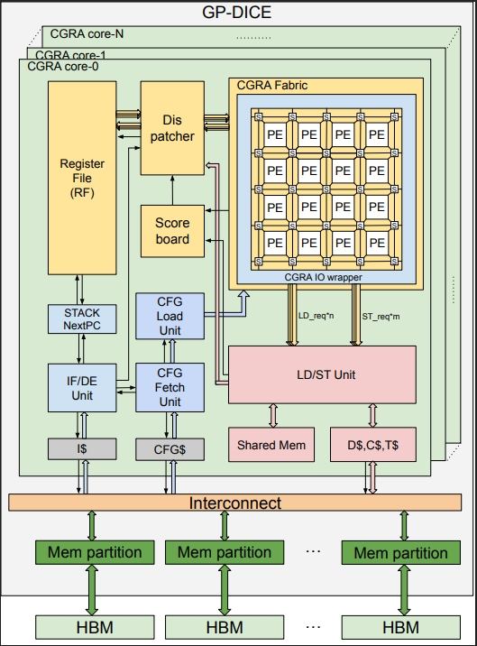
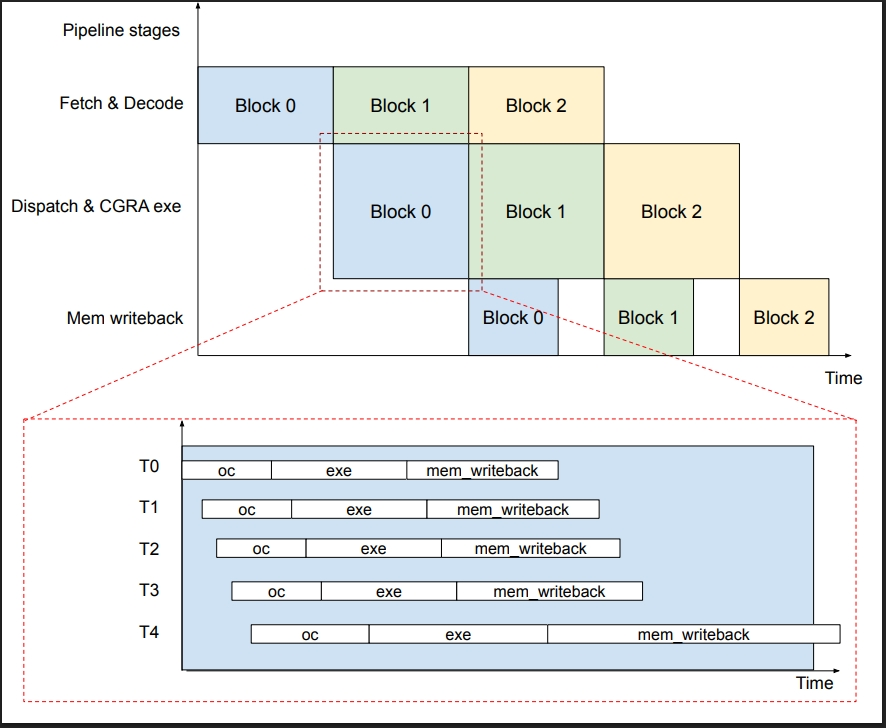
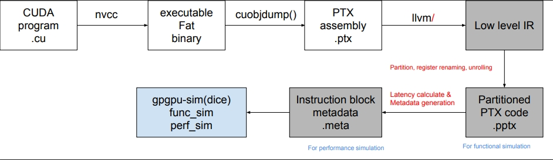
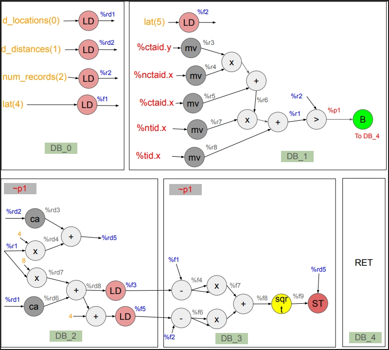
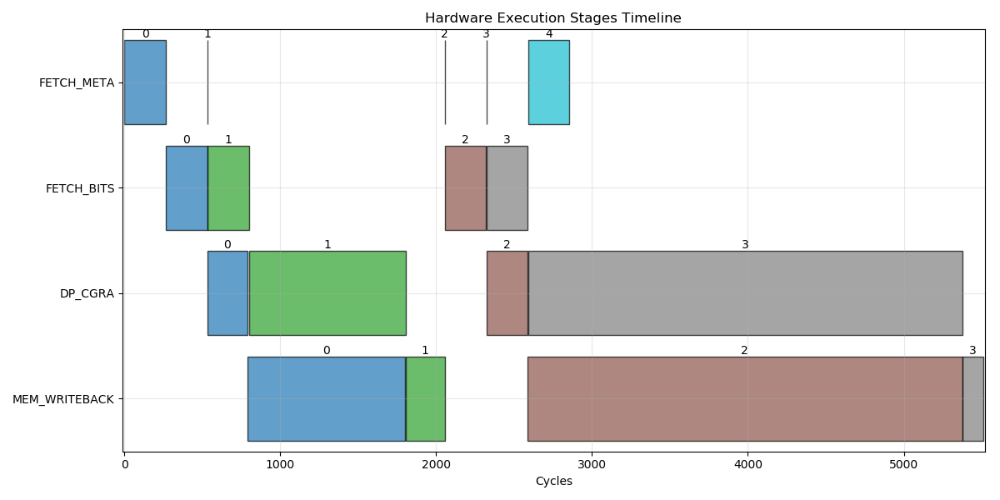
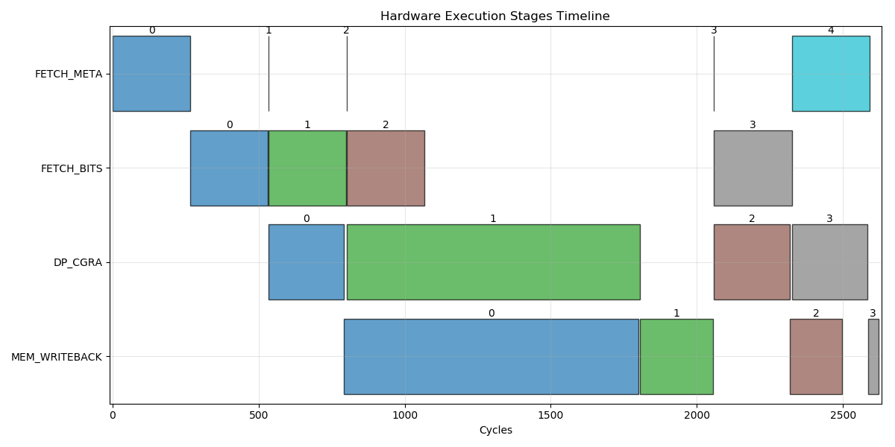
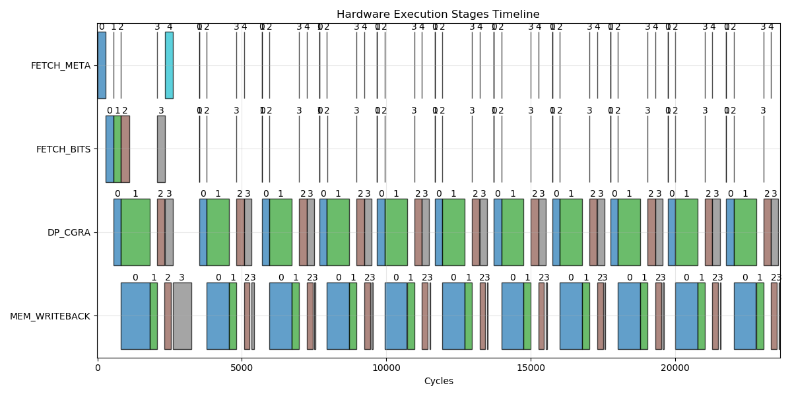

# DICE: A CUDA-Compatible CGRA-Based Alternative for GPGPUs 
*Authors:*  
- Jiayi Wang (jwang710@uw.edu), Department of Electrical and Computer Engineering, University of Washington, Seattle, USA  
- Ang Da Lu (angl7@uw.edu), Department of Electrical and Computer Engineering, University of Washington, Seattle, USA  
---

## Abstract

General-Purpose Graphics Processing Units (GPGPUs) dominate machine learning, image processing, and high-performance computing due to their Single-Instruction, Multiple-Threads (SIMT) execution model. However, their SIMD-based, von-Neumann architectures suffer from inefficiencies, including power-hungry register files, control divergence, and high switching activity. Coarse-Grained Reconfigurable Arrays (CGRAs) offer an efficient alternative, excelling in pipelined loops and thread-level parallelism, but their complex programming hinders adoption. We propose the **Dataflow Intelligent Compute Engine (DICE)**, a novel architecture that integrates a CGRA-based backend into GPGPUs, replacing the SIMD component while retaining CUDA compatibility. This hybrid design enhances power efficiency and resource utilization. In this report, we model DICE using GPGPU-sim, develop a custom LLVM-based compiler, and analyze its performance against GPGPUs on a benchmark.

**Keywords:** General Purpose Graphics Processing Unit (GPGPU), Coarse-Grained Reconfigurable Array (CGRA), Single Instruction Multiple Threads (SIMT), Parallel Computing, Low-level Virtual Machine (LLVM)

---

## Introduction and Background

GPGPUs are the go-to hardware for machine learning, image processing, and high-performance computing (HPC) due to their SIMT execution model. However, their SIMD-based von-Neumann design has inefficiencies:
1. Large centralized register files consume significant power and area.
2. Control divergence underutilizes computational resources.
3. High switching activity in shared execution units increases energy overhead.

In contrast, CGRAs excel in deeply pipelined loops and massive thread-level parallelism with high efficiency. However, their adoption is limited by programming complexity, requiring domain-specific languages or manual kernel annotation. To address these issues, we introduce **DICE**, a hybrid architecture that replaces the SIMD backend in GPGPUs with a CGRA while maintaining CUDA compatibility, improving power efficiency and resource utilization.

---

## Architecture Modeling with GPGPU-sim

### DICE Microarchitecture & Implementation

The core of DICE is a CGRA, a 2D array of coarse-grained Processing Elements (PEs) connected via a programmable routing network. Multiple CGRAs, combined with control units, scratchpad memory, and load/store units, form a CGRA core that replaces the traditional Stream Multiprocessor (SM) with a SIMD backend. Threads are executed in a pipelined manner, with a custom DICE compiler regrouping assembly code into instruction blocks mapped to CGRA configuration bitstreams.

  
*Figure 1: DICE architecture*

  
*Figure 2: Pipeline Execution Timeline*

### Fetch and Decode

The IF/DE Unit fetches instruction block metadata from main memory, decoding it to extract bitstream details sent to the dispatcher and LDST unit. The CFG Fetch Unit loads the bitstream into context memory, preparing the block for dispatch.

### Dispatch and CGRA Execution

The dispatcher assigns threads to the CGRA when dependencies are resolved, operands are fetched, and execution isn’t stalled. CGRA latency is precomputed, and the LDST unit manages memory accesses.

### Memory Writeback

This stage waits for load registers to return from memory, requiring no dedicated hardware and allowing multiple blocks to reside simultaneously.

### Implementation and Modeling

We implemented DICE in GPGPU-Sim, modifying it to support functional and performance modeling. A custom compiler optimizes PTX code into metadata for simulation.

  
*Figure 3: Modified GPGPU-Sim Flow to run DICE*

---

## Benchmark Analysis

We tested DICE on the NN benchmark from GPU-Rodinia, a workload with regular memory access and minimal control divergence. Two configurations were evaluated: a single block (256 threads, 1 core) and full-size (168 blocks, 15 cores).

  
*Figure 4: NN benchmark Dataflow Graph (DFG)*

| Device                  | # L1D Accesses | # L2 Accesses | # RF Accesses | # Cycles |
|-------------------------|----------------|---------------|---------------|----------|
| GPU (1 block, 1 core)   | 40             | 106           | 13,984        | 1,412    |
| DICE-initial (1 block)  | 794            | 1,114         | 4,864         | 5,687    |
| DICE-optimized (1 block)| 510            | 345           | 4,864         | 2,762    |
| GPU (168 blocks, 15 cores) | 6,683       | 16,188        | 2,182,976     | 3,688    |
| DICE-optimized (168 blocks) | 85,528    | 53,846        | 817,152       | 25,364   |

*Table 1: Comparison between DICE and GPU*

DICE reduces register file accesses by 62.4% but shows higher cache accesses and latency due to poor memory coalescing. Optimizations include:
- Increasing MSHR queue size from 8 to 32, reducing latency by 2,660 cycles.
- Adding branch prediction and prefetching.

Challenges remain:
- Low CGRA utilization (7 operations/block vs. 32 PEs).
- Redundant constant memory loads.
- Sequential execution stalls.

   
  
 
*Figure 5: DICE Execution Timeline (a) DICE-initial, (b) DICE-optimized (simple), (c) DICE-optimized (full))*

---

## Optimizing CUDA Kernels for Spatial Architectures

### Compiler Background

Traditional compilers are hardware-agnostic, but spatial architectures like DICE require resource-aware compilation. We developed a custom LLVM-based compiler to partition CUDA code optimally.

### Initial Approach

Our baseline algorithm partitions Basic Blocks (BB) into Partitioned PTX (PPTX) based on hardware constraints (e.g., max operations, I/O registers).

### Integer Linear Programming (ILP) for DICE Compilation

We use ILP to optimize partitioning:
- **Variables:**
  - `Inst_{i,c,m}`: Instruction `i` in config `c`, slot `m`.
  - `Prod_{i,c}`: Instruction `i` in config `c` produces consumable values.
  - `I_R_{i,c,r}`: Register `r` is live for instruction `i` in config `c`.
- **Constraints:**
  - Each instruction maps to one config and slot.
  - Load/store and operation dependencies enforce execution order.

The ILP balances computational density and communication overhead.

---

## Summary and Future Work

DICE integrates a CGRA backend into GPGPUs, reducing register file accesses by 62.4% while maintaining CUDA compatibility. However, performance lags due to low CGRA utilization and memory inefficiencies. Future work includes:
- Optimizing DFGs with thread unrolling.
- Reducing redundant memory loads.
- Enabling concurrent block execution.
- Enhancing the ILP-based compiler.
- Testing diverse benchmarks.

---

## References

1. A. Bakhoda et al., “Analyzing CUDA workloads using a detailed GPU simulator,” *IEEE ISPASS*, 2009.
2. S. Che et al., “Rodinia: A benchmark suite for heterogeneous computing,” *IEEE IISWC*, 2009.
3. T. M. Aamodt et al., *General-Purpose Graphics Processor Architectures*, Morgan & Claypool, 2018.
4. C. Lattner and V. Adve, “LLVM: a compilation framework for lifelong program analysis & transformation,” *CGO*, 2004.

